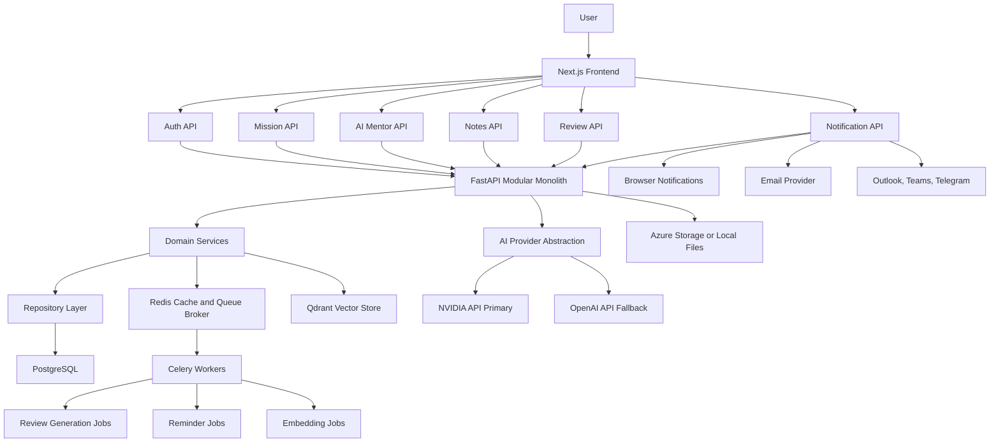
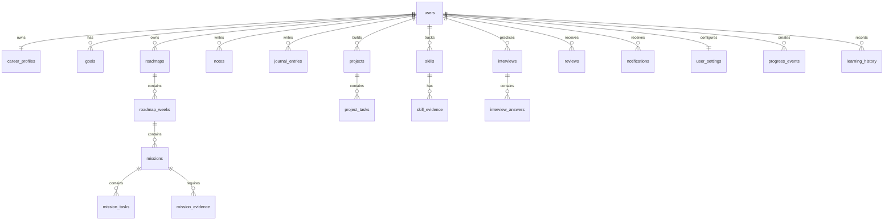

# Project ASCEND OS - MVP Architecture

## 1. Product Architecture

Project ASCEND OS is a single-user AI Career Operating System for an IT Operations Engineer progressing toward Enterprise AI & Cloud Architect. The MVP is intentionally not a task manager, notes app, or generic productivity tool. It is a daily execution system where the platform decides the next focused mission, explains why it matters, tracks evidence, and uses AI mentoring to improve skill, judgment, and consistency.

### Core Product Principles

- **One mission at a time:** The dashboard and mission page expose today's work only. Future missions remain locked until prerequisites are complete.
- **Evidence-driven progress:** A mission is not complete until the user produces evidence such as a note, lab output, GitHub link, reflection, interview answer, or project artifact.
- **AI as mentor, not answer machine:** The mentor challenges assumptions, asks questions, reviews thinking, and gives targeted feedback.
- **Adaptive roadmap:** The roadmap adjusts based on mission completion, interview performance, journal patterns, and skill gaps.
- **Small MVP, scalable foundation:** Start as a modular monolith with clean domain boundaries that can later become services.

### MVP Domains

| Domain | Responsibility |
| --- | --- |
| Identity | Single-user login, JWT sessions, OAuth-ready account model |
| Career Profile | Goal, role, target role, learning preferences, current level |
| Roadmap | 180-day plan, weekly structure, locked/unlocked missions |
| Mission Execution | Today's mission, tasks, completion criteria, evidence |
| AI Mentor | NVIDIA-first LLM abstraction, OpenAI fallback, mentor modes |
| Notes | Markdown notes linked to missions, skills, and projects |
| Journal | Daily engineering reflection and lessons learned |
| Interview Center | Daily questions, answer capture, AI review, scoring |
| Skill Matrix | Skill levels, target levels, evidence, learning hours |
| Projects | Portfolio projects, tasks, documentation, GitHub links |
| Reviews | Weekly and monthly performance summaries |
| Notifications | Mission, progress, reflection, weekly, and monthly reminders |

### MVP Scope

Included in MVP:

- Email login with JWT; OAuth interfaces designed, implementation can follow after MVP core.
- Dashboard with today's mission, progress, streak, skill radar, interview readiness, recent notes, and upcoming review.
- Generated 180-day roadmap with locked future missions.
- Daily mission page with learning, lab, documentation, reflection, interview question, and completion workflow.
- AI mentor chat with selectable personality.
- Markdown notes and daily journal.
- Interview answer submission and AI feedback.
- Skill matrix and basic analytics.
- Weekly and monthly review generation.
- Browser notifications and configurable reminder schedule.

Deferred:

- Multi-user organization features.
- Full mobile app.
- Real-time collaboration.
- Payments and SaaS billing.
- WhatsApp integration.
- Deep GitHub repository analytics.
- Advanced knowledge graph visualization.

## 2. System Architecture Diagram



### Architectural Style

- **Frontend:** Next.js App Router, TypeScript, Tailwind CSS, Shadcn UI, React Query, Zustand.
- **Backend:** FastAPI modular monolith using clean architecture.
- **Data:** PostgreSQL as source of truth, Redis for queues/cache, Qdrant for semantic search.
- **AI:** Provider abstraction with NVIDIA primary, OpenAI fallback.
- **Async:** Celery for scheduled reviews, reminders, embeddings, and long AI jobs.
- **Deployment:** Docker Compose locally; Azure Container Apps and Azure PostgreSQL later.

## 3. Database Schema

### Entity Overview



### Core Tables

#### users

| Column | Type | Notes |
| --- | --- | --- |
| id | uuid pk | Primary user identity |
| email | varchar unique | Login identifier |
| password_hash | varchar nullable | Null for OAuth-only accounts |
| display_name | varchar | User-facing name |
| auth_provider | varchar | email, google, github |
| created_at | timestamptz | Audit |
| updated_at | timestamptz | Audit |

#### career_profiles

| Column | Type | Notes |
| --- | --- | --- |
| id | uuid pk |  |
| user_id | uuid fk | users.id |
| current_role | varchar | IT Operations Engineer |
| target_role | varchar | Enterprise AI & Cloud Architect |
| learning_style | varchar | step_by_step |
| target_company | varchar nullable | Future personalization |
| target_salary | numeric nullable | Future personalization |
| preferred_daily_minutes | integer | Mission sizing |
| mentor_tone | varchar | friendly, strict, review |

#### roadmaps

| Column | Type | Notes |
| --- | --- | --- |
| id | uuid pk |  |
| user_id | uuid fk | users.id |
| title | varchar | 180-Day Enterprise AI & Cloud Architect |
| duration_days | integer | 180 |
| status | varchar | draft, active, completed, archived |
| generated_by | varchar | ai, template, manual |
| started_at | date nullable |  |
| created_at | timestamptz |  |

#### missions

| Column | Type | Notes |
| --- | --- | --- |
| id | uuid pk |  |
| roadmap_week_id | uuid fk | roadmap_weeks.id |
| day_number | integer | 1-180 |
| title | varchar |  |
| objective | text |  |
| business_context | text | Why it matters |
| learning_topic | varchar |  |
| practical_task | text | Hands-on work |
| documentation_prompt | text | Evidence prompt |
| reflection_prompt | text | Journal prompt |
| interview_question | text | Daily question |
| difficulty | integer | 1-5 |
| estimated_minutes | integer |  |
| status | varchar | locked, available, in_progress, completed, skipped |
| unlocked_at | timestamptz nullable |  |
| completed_at | timestamptz nullable |  |

#### mission_tasks

| Column | Type | Notes |
| --- | --- | --- |
| id | uuid pk |  |
| mission_id | uuid fk | missions.id |
| type | varchar | learning, lab, docs, reflection, interview |
| title | varchar |  |
| instructions | text |  |
| skill_improved | varchar |  |
| completion_criteria | text |  |
| status | varchar | pending, completed |

#### mission_evidence

| Column | Type | Notes |
| --- | --- | --- |
| id | uuid pk |  |
| mission_id | uuid fk | missions.id |
| user_id | uuid fk | users.id |
| evidence_type | varchar | note, journal, github, file, interview, text |
| reference_id | uuid nullable | Linked entity |
| url | text nullable | External evidence |
| summary | text |  |
| created_at | timestamptz |  |

#### notes

| Column | Type | Notes |
| --- | --- | --- |
| id | uuid pk |  |
| user_id | uuid fk | users.id |
| mission_id | uuid nullable fk | Linked mission |
| project_id | uuid nullable fk | Linked project |
| title | varchar |  |
| body_markdown | text |  |
| tags | text[] |  |
| folder | varchar nullable |  |
| embedding_status | varchar | pending, indexed, failed |
| created_at | timestamptz |  |
| updated_at | timestamptz |  |

#### journal_entries

| Column | Type | Notes |
| --- | --- | --- |
| id | uuid pk |  |
| user_id | uuid fk | users.id |
| mission_id | uuid nullable fk |  |
| entry_date | date | One or more entries per day |
| wins | text nullable |  |
| failures | text nullable |  |
| lessons_learned | text nullable |  |
| root_cause | text nullable |  |
| automation_ideas | text nullable |  |
| reflection | text |  |

#### interviews

| Column | Type | Notes |
| --- | --- | --- |
| id | uuid pk |  |
| user_id | uuid fk | users.id |
| mission_id | uuid nullable fk |  |
| interview_type | varchar | technical, scenario, behavioral |
| question | text |  |
| expected_topics | text[] |  |
| status | varchar | pending, answered, reviewed |
| created_at | timestamptz |  |

#### interview_answers

| Column | Type | Notes |
| --- | --- | --- |
| id | uuid pk |  |
| interview_id | uuid fk | interviews.id |
| answer_text | text |  |
| technical_score | integer nullable | 1-10 |
| communication_score | integer nullable | 1-10 |
| confidence_score | integer nullable | 1-10 |
| feedback | text nullable | AI review |
| weak_areas | text[] |  |
| created_at | timestamptz |  |

#### skills

| Column | Type | Notes |
| --- | --- | --- |
| id | uuid pk |  |
| user_id | uuid fk | users.id |
| name | varchar | Windows, Azure, PowerShell, etc. |
| current_level | integer | 1-10 |
| target_level | integer | 1-10 |
| learning_hours | numeric |  |
| interview_score | numeric nullable |  |
| confidence | integer | 1-10 |

#### reviews

| Column | Type | Notes |
| --- | --- | --- |
| id | uuid pk |  |
| user_id | uuid fk | users.id |
| review_type | varchar | weekly, monthly |
| period_start | date |  |
| period_end | date |  |
| metrics_json | jsonb | Completion, streak, scores |
| ai_feedback | text |  |
| improvement_plan | text |  |
| created_at | timestamptz |  |

#### notifications

| Column | Type | Notes |
| --- | --- | --- |
| id | uuid pk |  |
| user_id | uuid fk | users.id |
| channel | varchar | browser, email, outlook, teams, telegram |
| notification_type | varchar | morning, progress, reflection, weekly, monthly |
| scheduled_for | timestamptz |  |
| sent_at | timestamptz nullable |  |
| status | varchar | pending, sent, failed, muted |
| payload_json | jsonb |  |

### Supporting Tables

- `goals`: career goals, milestones, target dates.
- `roadmap_weeks`: week number, theme, objectives, locked state.
- `projects`: title, goal, problem statement, architecture, technologies, GitHub link, completion.
- `project_tasks`: project-specific task tracking.
- `skill_evidence`: links notes, missions, projects, and interview answers to skill growth.
- `progress_events`: append-only timeline of mission/task/review/project events.
- `learning_history`: time spent, topic, source, mission, skill.
- `user_settings`: reminder preferences, AI provider settings, theme, timezone.
- `ai_conversations`: mentor sessions, personality, linked context.
- `ai_messages`: prompt/response history, token usage, provider.

## 4. API Design

### API Conventions

- Base path: `/api/v1`
- Auth: JWT bearer token
- Response shape:

```json
{
  "data": {},
  "meta": {},
  "errors": []
}
```

- Error shape:

```json
{
  "data": null,
  "meta": {},
  "errors": [
    {
      "code": "MISSION_LOCKED",
      "message": "Complete the current mission before opening this one."
    }
  ]
}
```

### Auth

| Method | Endpoint | Purpose |
| --- | --- | --- |
| POST | `/auth/register` | Create email account |
| POST | `/auth/login` | Login with email/password |
| POST | `/auth/refresh` | Refresh token |
| POST | `/auth/logout` | Revoke session |
| GET | `/auth/me` | Current user |
| GET | `/auth/oauth/google/start` | Start Google login |
| GET | `/auth/oauth/github/start` | Start GitHub login |

### Dashboard

| Method | Endpoint | Purpose |
| --- | --- | --- |
| GET | `/dashboard/today` | Today's mission, progress, reminders, review, radar |
| GET | `/dashboard/analytics` | Weekly/monthly progress summaries |

### Roadmap and Missions

| Method | Endpoint | Purpose |
| --- | --- | --- |
| POST | `/roadmaps/generate` | Generate 180-day roadmap |
| GET | `/roadmaps/current` | Active roadmap |
| GET | `/roadmaps/current/weeks` | Week list |
| GET | `/missions/today` | Today's available mission |
| GET | `/missions/{mission_id}` | Mission details |
| POST | `/missions/{mission_id}/start` | Start mission |
| POST | `/missions/{mission_id}/tasks/{task_id}/complete` | Complete task |
| POST | `/missions/{mission_id}/evidence` | Attach evidence |
| POST | `/missions/{mission_id}/complete` | Complete mission and unlock next |

### AI Mentor

| Method | Endpoint | Purpose |
| --- | --- | --- |
| POST | `/mentor/chat` | Send message to AI mentor |
| GET | `/mentor/conversations` | List conversations |
| GET | `/mentor/conversations/{id}` | Conversation history |
| POST | `/mentor/review-answer` | Review interview answer |
| POST | `/mentor/review-mission` | Review mission evidence |
| POST | `/mentor/generate-review` | Generate weekly/monthly review |

### Notes and Journal

| Method | Endpoint | Purpose |
| --- | --- | --- |
| GET | `/notes` | List/search notes |
| POST | `/notes` | Create note |
| GET | `/notes/{id}` | Read note |
| PUT | `/notes/{id}` | Update note |
| DELETE | `/notes/{id}` | Delete note |
| GET | `/journal` | List journal entries |
| POST | `/journal` | Create journal entry |
| PUT | `/journal/{id}` | Update journal entry |

### Interview Center

| Method | Endpoint | Purpose |
| --- | --- | --- |
| GET | `/interviews/today` | Daily questions |
| POST | `/interviews/{id}/answer` | Submit answer |
| POST | `/interviews/{id}/review` | AI score and feedback |
| GET | `/interviews/history` | Prior practice |

### Skills and Projects

| Method | Endpoint | Purpose |
| --- | --- | --- |
| GET | `/skills` | Skill matrix |
| PUT | `/skills/{id}` | Update target/current levels |
| GET | `/skills/{id}/evidence` | Skill evidence |
| GET | `/projects` | List projects |
| POST | `/projects` | Create project |
| GET | `/projects/{id}` | Project details |
| PUT | `/projects/{id}` | Update project |

### Reviews and Notifications

| Method | Endpoint | Purpose |
| --- | --- | --- |
| GET | `/reviews` | Review history |
| POST | `/reviews/weekly/generate` | Generate weekly review |
| POST | `/reviews/monthly/generate` | Generate monthly review |
| GET | `/notifications/settings` | Reminder settings |
| PUT | `/notifications/settings` | Update settings |
| POST | `/notifications/test` | Test browser/email notification |

## 5. Frontend Component Tree

```text
app/
  layout.tsx
  page.tsx
  login/page.tsx
  dashboard/page.tsx
  mission/[missionId]/page.tsx
  roadmap/page.tsx
  mentor/page.tsx
  notes/page.tsx
  journal/page.tsx
  interviews/page.tsx
  skills/page.tsx
  projects/page.tsx
  reviews/page.tsx
  settings/page.tsx

components/
  app-shell/
    AppShell
    SidebarNav
    TopBar
    CommandMenu
    NotificationBell
  dashboard/
    TodayMissionPanel
    MissionProgressBar
    StreakCounter
    SkillRadarChart
    InterviewReadinessCard
    WeeklyProgressStrip
    RecentNotesList
    UpcomingReviewPanel
    FocusPanel
  mission/
    MissionHeader
    MissionObjective
    BusinessContextPanel
    TaskChecklist
    EvidenceUploader
    ReflectionEditor
    InterviewQuestionCard
    CompleteMissionDialog
  roadmap/
    RoadmapTimeline
    WeekSection
    LockedMissionItem
    ActiveMissionItem
    CompletedMissionItem
  mentor/
    MentorModeSelector
    MentorChat
    ContextDrawer
    FeedbackPanel
  notes/
    NotesSidebar
    NoteEditor
    MarkdownPreview
    TagSelector
    LinkedEntityPicker
  journal/
    DailyJournalEditor
    JournalCalendar
    LessonsLearnedPanel
  interviews/
    InterviewQuestionTabs
    AnswerEditor
    InterviewScorePanel
    FeedbackBreakdown
  skills/
    SkillMatrix
    SkillDetailDrawer
    EvidenceTimeline
  projects/
    ProjectList
    ProjectDetail
    ProjectTaskList
    ArchitectureNotesPanel
  reviews/
    ReviewSummary
    MetricsGrid
    ImprovementPlan
  settings/
    ProfileSettings
    ReminderSettings
    AiProviderSettings
    ThemeSettings
```

### Frontend State

- React Query owns server state and cache invalidation.
- Zustand owns lightweight client state such as selected mentor mode, sidebar state, current note draft, and theme preference.
- Server actions are avoided for core authenticated APIs in MVP; typed API clients keep web/backend boundaries explicit.

### UI Direction

- Dark mode first, professional Microsoft Fluent-inspired interface.
- Dense executive dashboard, not a marketing page.
- Cards only for individual panels and repeated objects.
- Primary dashboard action: continue today's mission.
- Future missions visually locked and non-clickable except for preview metadata.

## 6. Backend Folder Structure

```text
backend/
  app/
    main.py
    core/
      config.py
      security.py
      logging.py
      exceptions.py
      pagination.py
    api/
      deps.py
      v1/
        router.py
        auth.py
        dashboard.py
        roadmaps.py
        missions.py
        mentor.py
        notes.py
        journal.py
        interviews.py
        skills.py
        projects.py
        reviews.py
        notifications.py
    domain/
      identity/
        entities.py
        schemas.py
        services.py
        repositories.py
      career/
        entities.py
        services.py
      roadmap/
        entities.py
        services.py
        policies.py
      mission/
        entities.py
        services.py
        completion_policy.py
      mentor/
        services.py
        prompts.py
        memory.py
        provider.py
      notes/
        services.py
      journal/
        services.py
      interview/
        services.py
        scoring.py
      skills/
        services.py
      projects/
        services.py
      reviews/
        services.py
      notifications/
        services.py
    infrastructure/
      db/
        session.py
        base.py
        models/
        migrations/
      repositories/
        sqlalchemy/
      ai/
        nvidia_client.py
        openai_client.py
        embeddings.py
      vector/
        qdrant_client.py
      queue/
        celery_app.py
        tasks.py
      notifications/
        browser.py
        email.py
    tests/
      unit/
      integration/
      api/

frontend/
  app/
  components/
  features/
  lib/
    api/
    auth/
    query/
    store/
    validators/
  styles/
  tests/
    unit/
    e2e/

shared/
  schemas/
  api-contracts/

infra/
  docker/
  compose.yaml
  github-actions/
  azure/

docs/
  architecture/
  api/
  product/
  runbooks/

scripts/
  dev/
  db/
  seed/
```

## 7. User Flow

### First-Run Flow

1. User creates account or logs in.
2. User confirms career profile:
   - Current role: IT Operations Engineer.
   - Target role: Enterprise AI & Cloud Architect.
   - Learning style: step-by-step.
   - Daily time available.
3. System generates 180-day roadmap.
4. System unlocks Day 1 mission only.
5. User lands on dashboard with a clear primary action: continue today's mission.

### Daily Mission Flow

1. User opens dashboard.
2. Dashboard shows today's mission, progress, reminder, current skill focus, and interview readiness.
3. User opens mission page.
4. User completes learning task.
5. User completes practical task.
6. User writes documentation evidence.
7. User answers interview question.
8. User writes reflection.
9. AI mentor reviews evidence and answer.
10. User completes mission.
11. System records progress, updates skills, and unlocks the next mission.

### Weekly Review Flow

1. Every Sunday, review job gathers completed missions, notes, journal entries, interview scores, and skill changes.
2. AI generates weekly review.
3. User answers review prompts.
4. AI identifies biggest win, mistake, confusion, and next focus.
5. Next week's mission difficulty can be adjusted.

### Monthly Review Flow

1. System aggregates completion rate, learning hours, projects, interview performance, consistency, and skill growth.
2. AI generates a performance report and improvement plan.
3. User confirms or adjusts next month focus.

## 8. MVP Sprint Plan

### Sprint 0 - Foundation and Product Decisions

Duration: 3-4 days

- Finalize architecture and acceptance criteria.
- Create repository structure.
- Configure linting, formatting, Docker Compose, environment settings.
- Create design tokens and app shell direction.
- Define API contracts for dashboard, mission, roadmap, mentor.

Exit criteria:

- Local frontend/backend shells run.
- PostgreSQL and Redis run through Docker Compose.
- CI runs lint and tests.

### Sprint 1 - Identity, Profile, and Roadmap

Duration: 1 week

- Email auth with JWT.
- Career profile setup.
- Roadmap generation service using deterministic template plus AI enrichment.
- Mission locking model.
- Seed default skill matrix.

Exit criteria:

- User can log in, create profile, generate roadmap, and see locked missions.

### Sprint 2 - Dashboard and Daily Mission

Duration: 1 week

- Executive dashboard.
- Today's mission API.
- Mission detail page.
- Task completion and evidence capture.
- Progress events and streak calculation.

Exit criteria:

- User can complete a full daily mission with evidence and unlock the next mission.

### Sprint 3 - AI Mentor and Interview Center

Duration: 1 week

- NVIDIA/OpenAI provider abstraction.
- Mentor personalities.
- Context injection from profile, mission, notes, skills, and journal.
- Daily interview questions.
- Answer review and scoring.

Exit criteria:

- User can chat with mentor and receive structured interview feedback.

### Sprint 4 - Notes, Journal, Skills, and Projects

Duration: 1 week

- Markdown note editor.
- Daily journal.
- Skill matrix with evidence links.
- Project tracking.
- Basic semantic indexing pipeline.

Exit criteria:

- Notes, journals, projects, and skills connect back to missions and evidence.

### Sprint 5 - Reviews, Notifications, QA, and Release

Duration: 1 week

- Weekly review generation.
- Monthly review generation.
- Browser notifications and reminder settings.
- E2E tests for the main daily mission path.
- Deployment documentation.

Exit criteria:

- MVP is usable end to end for daily execution and review.

## 9. Development Roadmap

### Phase 1 - MVP

- Single-user career OS.
- Daily mission execution.
- AI mentor.
- Notes, journal, interviews, skill matrix, reviews.
- Browser notifications.

### Phase 2 - Strong Personalization

- Adaptive mission difficulty.
- Spaced repetition.
- Better semantic search.
- GitHub activity import.
- Microsoft Learn resource integration.
- Advanced interview simulations.

### Phase 3 - Platform Integrations

- Outlook and Teams notifications.
- Google Calendar sync.
- OneDrive/Google Drive attachments.
- VS Code extension.
- Obsidian and Notion import.

### Phase 4 - SaaS Readiness

- Multi-user account model.
- Organizations and teams.
- RBAC.
- Billing.
- Admin observability.
- Tenant isolation.

### Phase 5 - Enterprise Intelligence

- Knowledge graph visualization.
- Portfolio evaluator.
- Resume readiness engine.
- Job readiness engine.
- Cloud architecture lab generator.
- Local LLM/offline mode.

## 10. Risks

| Risk | Impact | Mitigation |
| --- | --- | --- |
| MVP becomes too broad | Slow delivery | Protect daily mission path as the primary flow |
| AI output is vague | Low trust | Use structured prompts, rubrics, and evidence-based context |
| Roadmap generation is inconsistent | Poor learning path | Start from deterministic templates, let AI enrich not invent everything |
| User feels overwhelmed | Product failure | Show only today's mission; keep future missions locked |
| Evidence becomes busywork | Low adoption | Make evidence lightweight and directly useful for portfolio/reviews |
| LLM provider downtime | Broken mentor flow | Provider abstraction with fallback and graceful degraded responses |
| Poor data model boundaries | Hard to scale | Use domain modules and repository interfaces from day one |
| Notifications become annoying | Churn | User-configurable schedule and quiet hours |
| Semantic memory leaks sensitive info | Privacy risk | Clear memory boundaries, encryption, and opt-in indexing controls |

## 11. Security Considerations

### Authentication and Authorization

- JWT access tokens with refresh tokens.
- Refresh token rotation.
- Password hashing with Argon2 or bcrypt.
- OAuth account linking model for Google and GitHub.
- RBAC schema prepared even though MVP is single-user.

### Data Protection

- Encrypt secrets with environment-specific secret management.
- Use Azure Key Vault for production secrets.
- Encrypt sensitive columns later if multi-tenant SaaS data requires it.
- Avoid logging prompts that contain private journal content unless explicit debug mode is enabled.

### AI Safety and Privacy

- Centralize all AI calls through provider abstraction.
- Redact secrets from prompts.
- Separate system prompts, user content, and retrieved context.
- Store token usage and provider metadata for auditing.
- Allow user to clear AI conversation history.

### API Security

- Validate all request bodies with Pydantic.
- Rate limit AI and auth endpoints.
- Apply CORS allowlist.
- Use strict file upload size and type validation.
- Use parameterized queries through SQLAlchemy.

### Infrastructure

- Use non-root containers.
- Run database migrations through controlled process.
- Add health checks for frontend, backend, database, Redis, and workers.
- Add audit events for login, mission completion, settings changes, and AI provider changes.

## 12. Acceptance Criteria

### Product Acceptance

- User can log in and see a personalized career dashboard.
- User can generate a 180-day roadmap for becoming an Enterprise AI & Cloud Architect.
- Only today's mission is actionable; future missions are locked.
- Every mission explains objective, business context, skill improved, task instructions, and completion criteria.
- Mission completion requires evidence.
- Completing today's mission unlocks the next mission.
- User can ask the AI mentor for help and receive mentor-style feedback rather than a simple answer.
- User can capture notes and journal entries linked to missions.
- User can answer interview questions and receive scored feedback.
- User can view skill progress and evidence.
- User can generate weekly and monthly reviews.
- User can configure reminder preferences.

### Technical Acceptance

- Frontend is implemented in Next.js, TypeScript, Tailwind CSS, Shadcn UI, React Query, and Zustand.
- Backend is implemented in FastAPI, SQLAlchemy, PostgreSQL, Redis, and Celery.
- AI calls use a provider abstraction with NVIDIA primary and OpenAI fallback.
- Database migrations are versioned.
- Core daily mission path has API tests and E2E coverage.
- Docker Compose starts local app dependencies.
- CI runs linting and tests.
- No hardcoded secrets are committed.
- Application can be deployed to Azure-ready container infrastructure.

### MVP Completion Definition

The MVP is complete when a user can run one full career-development day inside the product:

1. Open dashboard.
2. Understand today's mission.
3. Complete learning and practical work.
4. Add evidence.
5. Answer interview question.
6. Receive AI feedback.
7. Write reflection.
8. Complete mission.
9. See progress update.
10. Unlock the next mission.

## Implementation Approval Gate

Coding should begin only after this architecture is approved. The recommended first implementation module is:

1. Repository structure and local development foundation.
2. Backend identity, profile, roadmap, and mission schema.
3. Frontend app shell, dashboard, and mission page.
4. AI mentor provider abstraction.
5. Notes, journal, interviews, reviews, and reminders.
